# Tri Rapide (Quick Sort) — Visualisation

## Tableau initial : `[5, 2, 4, 1, 3]`

> **Principe** : On choisit un **pivot** (ici le dernier élément), puis on partitionne
> le tableau en deux : les éléments **≤ pivot** à gauche, les éléments **> pivot** à droite.
> On répète récursivement sur chaque sous-tableau.

```mermaid
flowchart TD
    subgraph INIT["État initial"]
        direction LR
        I0["<b>5</b>"] ~~~ I1["<b>2</b>"] ~~~ I2["<b>4</b>"] ~~~ I3["<b>1</b>"] ~~~ I4["<b>3</b>"]
    end

    INIT --> CALL1

    subgraph CALL1["quickSort(0, 4) — pivot = carte[4] = 3"]
        direction TB

        subgraph C1_START["Partition — pivot = 3 🎯"]
            direction LR
            C1S0["5"] ~~~ C1S1["2"] ~~~ C1S2["4"] ~~~ C1S3["1"] ~~~ C1S4["<b>3 🎯</b>"]
        end

        C1_START --> C1_I0["i=-1, j=0 : carte[0]=5 > 3 → rien"]
        C1_I0 --> C1_I1["i=-1, j=1 : carte[1]=2 ≤ 3 → i=0, 🔄 SWAP carte[0] ↔ carte[1]"]

        subgraph C1_SWAP1["Après swap"]
            direction LR
            C1W1_0["<b>2</b>"] ~~~ C1W1_1["<b>5</b>"] ~~~ C1W1_2["4"] ~~~ C1W1_3["1"] ~~~ C1W1_4["3 🎯"]
        end

        C1_I1 --> C1_SWAP1
        C1_SWAP1 --> C1_I2["i=0, j=2 : carte[2]=4 > 3 → rien"]
        C1_I2 --> C1_I3["i=0, j=3 : carte[3]=1 ≤ 3 → i=1, 🔄 SWAP carte[1] ↔ carte[3]"]

        subgraph C1_SWAP2["Après swap"]
            direction LR
            C1W2_0["2"] ~~~ C1W2_1["<b>1</b>"] ~~~ C1W2_2["4"] ~~~ C1W2_3["<b>5</b>"] ~~~ C1W2_4["3 🎯"]
        end

        C1_I3 --> C1_SWAP2
        C1_SWAP2 --> C1_PIVOT["Place le pivot : 🔄 SWAP carte[2] ↔ carte[4] — i+1=2"]

        subgraph C1_RESULT["Après partition — pivot 3 en position 2 ✅"]
            direction LR
            C1R0["2"] ~~~ C1R1["1"] ~~~ C1R2["<b>3 ✅</b>"] ~~~ C1R3["5"] ~~~ C1R4["4"]
        end

        C1_PIVOT --> C1_RESULT
    end

    CALL1 --> SPLIT1["Le tableau est divisé en 2 sous-tableaux autour du pivot 3"]

    SPLIT1 --> CALL2
    SPLIT1 --> CALL3

    subgraph CALL2["quickSort(0, 1) — sous-tableau gauche [2, 1] — pivot = carte[1] = 1"]
        direction TB

        subgraph C2_START["Partition — pivot = 1 🎯"]
            direction LR
            C2S0["2"] ~~~ C2S1["<b>1 🎯</b>"]
        end

        C2_START --> C2_I0["i=-1, j=0 : carte[0]=2 > 1 → rien"]
        C2_I0 --> C2_PIVOT["Place le pivot : 🔄 SWAP carte[0] ↔ carte[1] — i+1=0"]

        subgraph C2_RESULT["Après partition — pivot 1 en position 0 ✅"]
            direction LR
            C2R0["<b>1 ✅</b>"] ~~~ C2R1["<b>2 ✅</b>"]
        end

        C2_PIVOT --> C2_RESULT
    end

    subgraph CALL3["quickSort(3, 4) — sous-tableau droit [5, 4] — pivot = carte[4] = 4"]
        direction TB

        subgraph C3_START["Partition — pivot = 4 🎯"]
            direction LR
            C3S0["5"] ~~~ C3S1["<b>4 🎯</b>"]
        end

        C3_START --> C3_I0["i=2, j=3 : carte[3]=5 > 4 → rien"]
        C3_I0 --> C3_PIVOT["Place le pivot : 🔄 SWAP carte[3] ↔ carte[4] — i+1=3"]

        subgraph C3_RESULT["Après partition — pivot 4 en position 3 ✅"]
            direction LR
            C3R0["<b>4 ✅</b>"] ~~~ C3R1["<b>5 ✅</b>"]
        end

        C3_PIVOT --> C3_RESULT
    end

    CALL2 --> MERGE
    CALL3 --> MERGE

    subgraph MERGE["Recombinaison des sous-tableaux"]
        direction TB
        M_EXPLAIN["Gauche: 1, 2 | Pivot: 3 | Droite: 4, 5"]

        subgraph M_RESULT["Tableau recombiné"]
            direction LR
            M0["<b>1 ✅</b>"] ~~~ M1["<b>2 ✅</b>"] ~~~ M2["<b>3 ✅</b>"] ~~~ M3["<b>4 ✅</b>"] ~~~ M4["<b>5 ✅</b>"]
        end

        M_EXPLAIN --> M_RESULT
    end

    MERGE --> RESULT

    subgraph RESULT["🎉 Résultat final — Tableau trié"]
        direction LR
        R0["<b>1</b>"] ~~~ R1["<b>2</b>"] ~~~ R2["<b>3</b>"] ~~~ R3["<b>4</b>"] ~~~ R4["<b>5</b>"]
    end

    style INIT fill:#e3f2fd,stroke:#1565c0,color:#000
    style RESULT fill:#e8f5e9,stroke:#2e7d32,color:#000

    style C1_START fill:#fff3e0,stroke:#e65100,color:#000
    style C1_SWAP1 fill:#fce4ec,stroke:#c62828,color:#000
    style C1_SWAP2 fill:#fce4ec,stroke:#c62828,color:#000
    style C1_RESULT fill:#e8f5e9,stroke:#2e7d32,color:#000

    style C2_START fill:#fff3e0,stroke:#e65100,color:#000
    style C2_RESULT fill:#e8f5e9,stroke:#2e7d32,color:#000

    style C3_START fill:#fff3e0,stroke:#e65100,color:#000
    style C3_RESULT fill:#e8f5e9,stroke:#2e7d32,color:#000

    style MERGE fill:#e3f2fd,stroke:#1565c0,color:#000
    style M_RESULT fill:#e8f5e9,stroke:#2e7d32,color:#000
```

### Arbre de récursion

```mermaid
flowchart TD
    A["quickSort(0,4)<br/>pivot=3<br/>[5, 2, 4, 1, 3]"]
    A -->|"≤ 3"| B["quickSort(0,1)<br/>pivot=1<br/>[2, 1]"]
    A -->|"> 3"| C["quickSort(3,4)<br/>pivot=4<br/>[5, 4]"]

    B -->|"≤ 1"| D["quickSort(0,-1)<br/>⛔ taille ≤ 0 → retour"]
    B -->|"> 1"| E["quickSort(1,1)<br/>⛔ taille ≤ 0 → retour"]

    C -->|"≤ 4"| F["quickSort(3,2)<br/>⛔ taille ≤ 0 → retour"]
    C -->|"> 4"| G["quickSort(4,4)<br/>⛔ taille ≤ 0 → retour"]

    style A fill:#e3f2fd,stroke:#1565c0,color:#000
    style B fill:#fff3e0,stroke:#e65100,color:#000
    style C fill:#fff3e0,stroke:#e65100,color:#000
    style D fill:#e0e0e0,stroke:#757575,color:#000
    style E fill:#e0e0e0,stroke:#757575,color:#000
    style F fill:#e0e0e0,stroke:#757575,color:#000
    style G fill:#e0e0e0,stroke:#757575,color:#000
```

