# Tri à Bulles (Bubble Sort) — Visualisation

## Tableau initial : `[5, 2, 4, 1, 3]`

> **Principe** : On parcourt le tableau plusieurs fois. À chaque passage, on **compare deux éléments voisins** :
> si le gauche est plus grand que le droit, on les **échange** (swap). Ainsi, le plus grand élément
> "remonte" comme une **bulle** 🫧 vers la fin du tableau à chaque passage.

```mermaid
flowchart TD
    subgraph INIT["État initial"]
        direction LR
        I0["<b>5</b>"] ~~~ I1["<b>2</b>"] ~~~ I2["<b>4</b>"] ~~~ I3["<b>1</b>"] ~~~ I4["<b>3</b>"]
    end

    INIT --> PASS1_TITLE

    subgraph PASS1_TITLE["Passage 1 — on parcourt de 0 à 3"]
        direction TB

        subgraph P1_START["Début"]
            direction LR
            P1S0["5"] ~~~ P1S1["2"] ~~~ P1S2["4"] ~~~ P1S3["1"] ~~~ P1S4["3"]
        end

        P1_START --> P1_CMP1["Compare carte[0]=5 et carte[1]=2 → 5 > 2 → 🔄 SWAP"]

        subgraph P1_AFTER1["Après swap"]
            direction LR
            P1A1_0["<b>2</b>"] ~~~ P1A1_1["<b>5</b>"] ~~~ P1A1_2["4"] ~~~ P1A1_3["1"] ~~~ P1A1_4["3"]
        end

        P1_CMP1 --> P1_AFTER1
        P1_AFTER1 --> P1_CMP2["Compare carte[1]=5 et carte[2]=4 → 5 > 4 → 🔄 SWAP"]

        subgraph P1_AFTER2["Après swap"]
            direction LR
            P1A2_0["2"] ~~~ P1A2_1["<b>4</b>"] ~~~ P1A2_2["<b>5</b>"] ~~~ P1A2_3["1"] ~~~ P1A2_4["3"]
        end

        P1_CMP2 --> P1_AFTER2
        P1_AFTER2 --> P1_CMP3["Compare carte[2]=5 et carte[3]=1 → 5 > 1 → 🔄 SWAP"]

        subgraph P1_AFTER3["Après swap"]
            direction LR
            P1A3_0["2"] ~~~ P1A3_1["4"] ~~~ P1A3_2["<b>1</b>"] ~~~ P1A3_3["<b>5</b>"] ~~~ P1A3_4["3"]
        end

        P1_CMP3 --> P1_AFTER3
        P1_AFTER3 --> P1_CMP4["Compare carte[3]=5 et carte[4]=3 → 5 > 3 → 🔄 SWAP"]

        subgraph P1_AFTER4["Résultat passage 1 — 5 est à sa place 🫧"]
            direction LR
            P1A4_0["2"] ~~~ P1A4_1["4"] ~~~ P1A4_2["1"] ~~~ P1A4_3["<b>3</b>"] ~~~ P1A4_4["<b>5 ✅</b>"]
        end

        P1_CMP4 --> P1_AFTER4
    end

    PASS1_TITLE --> PASS2_TITLE

    subgraph PASS2_TITLE["Passage 2 — on parcourt de 0 à 2"]
        direction TB

        subgraph P2_START["Début"]
            direction LR
            P2S0["2"] ~~~ P2S1["4"] ~~~ P2S2["1"] ~~~ P2S3["3"] ~~~ P2S4["5 ✅"]
        end

        P2_START --> P2_CMP1["Compare carte[0]=2 et carte[1]=4 → 2 ≤ 4 → Pas de swap ✋"]
        P2_CMP1 --> P2_CMP2["Compare carte[1]=4 et carte[2]=1 → 4 > 1 → 🔄 SWAP"]

        subgraph P2_AFTER2["Après swap"]
            direction LR
            P2A2_0["2"] ~~~ P2A2_1["<b>1</b>"] ~~~ P2A2_2["<b>4</b>"] ~~~ P2A2_3["3"] ~~~ P2A2_4["5 ✅"]
        end

        P2_CMP2 --> P2_AFTER2
        P2_AFTER2 --> P2_CMP3["Compare carte[2]=4 et carte[3]=3 → 4 > 3 → 🔄 SWAP"]

        subgraph P2_AFTER3["Résultat passage 2 — 4 est à sa place 🫧"]
            direction LR
            P2A3_0["2"] ~~~ P2A3_1["1"] ~~~ P2A3_2["<b>3</b>"] ~~~ P2A3_3["<b>4 ✅</b>"] ~~~ P2A3_4["5 ✅"]
        end

        P2_CMP3 --> P2_AFTER3
    end

    PASS2_TITLE --> PASS3_TITLE

    subgraph PASS3_TITLE["Passage 3 — on parcourt de 0 à 1"]
        direction TB

        subgraph P3_START["Début"]
            direction LR
            P3S0["2"] ~~~ P3S1["1"] ~~~ P3S2["3"] ~~~ P3S3["4 ✅"] ~~~ P3S4["5 ✅"]
        end

        P3_START --> P3_CMP1["Compare carte[0]=2 et carte[1]=1 → 2 > 1 → 🔄 SWAP"]

        subgraph P3_AFTER1["Après swap"]
            direction LR
            P3A1_0["<b>1</b>"] ~~~ P3A1_1["<b>2</b>"] ~~~ P3A1_2["3"] ~~~ P3A1_3["4 ✅"] ~~~ P3A1_4["5 ✅"]
        end

        P3_CMP1 --> P3_AFTER1
        P3_AFTER1 --> P3_CMP2["Compare carte[1]=2 et carte[2]=3 → 2 ≤ 3 → Pas de swap ✋"]

        subgraph P3_AFTER2["Résultat passage 3 — 3 est à sa place 🫧"]
            direction LR
            P3A2_0["1"] ~~~ P3A2_1["2"] ~~~ P3A2_2["<b>3 ✅</b>"] ~~~ P3A2_3["4 ✅"] ~~~ P3A2_4["5 ✅"]
        end

        P3_CMP2 --> P3_AFTER2
    end

    PASS3_TITLE --> PASS4_TITLE

    subgraph PASS4_TITLE["Passage 4 — on parcourt de 0 à 0"]
        direction TB

        subgraph P4_START["Début"]
            direction LR
            P4S0["1"] ~~~ P4S1["2"] ~~~ P4S2["3 ✅"] ~~~ P4S3["4 ✅"] ~~~ P4S4["5 ✅"]
        end

        P4_START --> P4_CMP1["Compare carte[0]=1 et carte[1]=2 → 1 ≤ 2 → Pas de swap ✋"]

        subgraph P4_AFTER["Résultat passage 4 — tout est trié 🫧"]
            direction LR
            P4A0["<b>1 ✅</b>"] ~~~ P4A1["<b>2 ✅</b>"] ~~~ P4A2["3 ✅"] ~~~ P4A3["4 ✅"] ~~~ P4A4["5 ✅"]
        end

        P4_CMP1 --> P4_AFTER
    end

    PASS4_TITLE --> RESULT

    subgraph RESULT["🎉 Résultat final — Tableau trié"]
        direction LR
        R0["<b>1</b>"] ~~~ R1["<b>2</b>"] ~~~ R2["<b>3</b>"] ~~~ R3["<b>4</b>"] ~~~ R4["<b>5</b>"]
    end

    style INIT fill:#e3f2fd,stroke:#1565c0,color:#000
    style RESULT fill:#e8f5e9,stroke:#2e7d32,color:#000

    style P1_START fill:#fff3e0,stroke:#e65100,color:#000
    style P1_AFTER1 fill:#fce4ec,stroke:#c62828,color:#000
    style P1_AFTER2 fill:#fce4ec,stroke:#c62828,color:#000
    style P1_AFTER3 fill:#fce4ec,stroke:#c62828,color:#000
    style P1_AFTER4 fill:#e8f5e9,stroke:#2e7d32,color:#000

    style P2_START fill:#fff3e0,stroke:#e65100,color:#000
    style P2_AFTER2 fill:#fce4ec,stroke:#c62828,color:#000
    style P2_AFTER3 fill:#e8f5e9,stroke:#2e7d32,color:#000

    style P3_START fill:#fff3e0,stroke:#e65100,color:#000
    style P3_AFTER1 fill:#fce4ec,stroke:#c62828,color:#000
    style P3_AFTER2 fill:#e8f5e9,stroke:#2e7d32,color:#000

    style P4_START fill:#fff3e0,stroke:#e65100,color:#000
    style P4_AFTER fill:#e8f5e9,stroke:#2e7d32,color:#000
```

