# Tri par Insertion — Visualisation

## Tableau initial : `[5, 2, 4, 1, 3]`

> **Principe** : On prend les cartes une par une (de gauche à droite). Pour chaque nouvelle carte,
> on la **compare avec les cartes précédentes** et on **décale vers la droite** toutes celles qui sont
> plus grandes, puis on **insère** la carte à sa bonne position dans la partie déjà triée.

```mermaid
flowchart TD
    subgraph INIT["État initial"]
        direction LR
        I0["<b>5</b>"] ~~~ I1["<b>2</b>"] ~~~ I2["<b>4</b>"] ~~~ I3["<b>1</b>"] ~~~ I4["<b>3</b>"]
    end

    INIT --> STEP1_TITLE

    subgraph STEP1_TITLE["Étape 1 — valeur = carte[1] = 2"]
        direction TB

        subgraph S1_BEFORE["Avant"]
            direction LR
            S1B0["5"] ~~~ S1B1["<b>2 ✋</b>"] ~~~ S1B2["4"] ~~~ S1B3["1"] ~~~ S1B4["3"]
        end

        S1_BEFORE --> S1_MOVE1["checkPos=0 : carte[0]=5 > 2 → décale 5 à droite ➡️"]

        subgraph S1_SHIFT["Décalage"]
            direction LR
            S1S0["___"] ~~~ S1S1["5"] ~~~ S1S2["4"] ~~~ S1S3["1"] ~~~ S1S4["3"]
        end

        S1_MOVE1 --> S1_SHIFT
        S1_SHIFT --> S1_INSERT["Insère 2 en position 0 ✅"]

        subgraph S1_AFTER["Après"]
            direction LR
            S1A0["<b>2</b>"] ~~~ S1A1["5"] ~~~ S1A2["4"] ~~~ S1A3["1"] ~~~ S1A4["3"]
        end

        S1_INSERT --> S1_AFTER
    end

    STEP1_TITLE --> STEP2_TITLE

    subgraph STEP2_TITLE["Étape 2 — valeur = carte[2] = 4"]
        direction TB

        subgraph S2_BEFORE["Avant"]
            direction LR
            S2B0["2"] ~~~ S2B1["5"] ~~~ S2B2["<b>4 ✋</b>"] ~~~ S2B3["1"] ~~~ S2B4["3"]
        end

        S2_BEFORE --> S2_MOVE1["checkPos=1 : carte[1]=5 > 4 → décale 5 à droite ➡️"]

        subgraph S2_SHIFT["Décalage"]
            direction LR
            S2S0["2"] ~~~ S2S1["___"] ~~~ S2S2["5"] ~~~ S2S3["1"] ~~~ S2S4["3"]
        end

        S2_MOVE1 --> S2_SHIFT
        S2_SHIFT --> S2_CHECK["checkPos=0 : carte[0]=2 ≤ 4 → STOP 🛑"]
        S2_CHECK --> S2_INSERT["Insère 4 en position 1 ✅"]

        subgraph S2_AFTER["Après"]
            direction LR
            S2A0["2"] ~~~ S2A1["<b>4</b>"] ~~~ S2A2["5"] ~~~ S2A3["1"] ~~~ S2A4["3"]
        end

        S2_INSERT --> S2_AFTER
    end

    STEP2_TITLE --> STEP3_TITLE

    subgraph STEP3_TITLE["Étape 3 — valeur = carte[3] = 1"]
        direction TB

        subgraph S3_BEFORE["Avant"]
            direction LR
            S3B0["2"] ~~~ S3B1["4"] ~~~ S3B2["5"] ~~~ S3B3["<b>1 ✋</b>"] ~~~ S3B4["3"]
        end

        S3_BEFORE --> S3_MOVE1["checkPos=2 : carte[2]=5 > 1 → décale 5 à droite ➡️"]
        S3_MOVE1 --> S3_MOVE2["checkPos=1 : carte[1]=4 > 1 → décale 4 à droite ➡️"]
        S3_MOVE2 --> S3_MOVE3["checkPos=0 : carte[0]=2 > 1 → décale 2 à droite ➡️"]

        subgraph S3_SHIFT["Décalages"]
            direction LR
            S3S0["___"] ~~~ S3S1["2"] ~~~ S3S2["4"] ~~~ S3S3["5"] ~~~ S3S4["3"]
        end

        S3_MOVE3 --> S3_SHIFT
        S3_SHIFT --> S3_INSERT["Insère 1 en position 0 ✅"]

        subgraph S3_AFTER["Après"]
            direction LR
            S3A0["<b>1</b>"] ~~~ S3A1["2"] ~~~ S3A2["4"] ~~~ S3A3["5"] ~~~ S3A4["3"]
        end

        S3_INSERT --> S3_AFTER
    end

    STEP3_TITLE --> STEP4_TITLE

    subgraph STEP4_TITLE["Étape 4 — valeur = carte[4] = 3"]
        direction TB

        subgraph S4_BEFORE["Avant"]
            direction LR
            S4B0["1"] ~~~ S4B1["2"] ~~~ S4B2["4"] ~~~ S4B3["5"] ~~~ S4B4["<b>3 ✋</b>"]
        end

        S4_BEFORE --> S4_MOVE1["checkPos=3 : carte[3]=5 > 3 → décale 5 à droite ➡️"]
        S4_MOVE1 --> S4_MOVE2["checkPos=2 : carte[2]=4 > 3 → décale 4 à droite ➡️"]

        subgraph S4_SHIFT["Décalages"]
            direction LR
            S4S0["1"] ~~~ S4S1["2"] ~~~ S4S2["___"] ~~~ S4S3["4"] ~~~ S4S4["5"]
        end

        S4_MOVE2 --> S4_SHIFT
        S4_SHIFT --> S4_CHECK["checkPos=1 : carte[1]=2 ≤ 3 → STOP 🛑"]
        S4_CHECK --> S4_INSERT["Insère 3 en position 2 ✅"]

        subgraph S4_AFTER["Après"]
            direction LR
            S4A0["1"] ~~~ S4A1["2"] ~~~ S4A2["<b>3</b>"] ~~~ S4A3["4"] ~~~ S4A4["5"]
        end

        S4_INSERT --> S4_AFTER
    end

    STEP4_TITLE --> RESULT

    subgraph RESULT["🎉 Résultat final — Tableau trié"]
        direction LR
        R0["<b>1</b>"] ~~~ R1["<b>2</b>"] ~~~ R2["<b>3</b>"] ~~~ R3["<b>4</b>"] ~~~ R4["<b>5</b>"]
    end

    style INIT fill:#e3f2fd,stroke:#1565c0,color:#000
    style RESULT fill:#e8f5e9,stroke:#2e7d32,color:#000

    style S1_BEFORE fill:#fff3e0,stroke:#e65100,color:#000
    style S1_SHIFT fill:#fce4ec,stroke:#c62828,color:#000
    style S1_AFTER fill:#e8f5e9,stroke:#2e7d32,color:#000

    style S2_BEFORE fill:#fff3e0,stroke:#e65100,color:#000
    style S2_SHIFT fill:#fce4ec,stroke:#c62828,color:#000
    style S2_AFTER fill:#e8f5e9,stroke:#2e7d32,color:#000

    style S3_BEFORE fill:#fff3e0,stroke:#e65100,color:#000
    style S3_SHIFT fill:#fce4ec,stroke:#c62828,color:#000
    style S3_AFTER fill:#e8f5e9,stroke:#2e7d32,color:#000

    style S4_BEFORE fill:#fff3e0,stroke:#e65100,color:#000
    style S4_SHIFT fill:#fce4ec,stroke:#c62828,color:#000
    style S4_AFTER fill:#e8f5e9,stroke:#2e7d32,color:#000
```

