# Tri par Sélection (Selection Sort) — Visualisation

## Tableau initial : `[5, 2, 4, 1, 3]`

> **Principe** : À chaque étape, on **cherche le plus petit élément** dans la partie non triée
> du tableau, puis on l'**échange** avec le premier élément non trié. La partie triée grandit
> d'un élément à chaque itération, de gauche à droite.

```mermaid
flowchart TD
    subgraph INIT["État initial"]
        direction LR
        I0["<b>5</b>"] ~~~ I1["<b>2</b>"] ~~~ I2["<b>4</b>"] ~~~ I3["<b>1</b>"] ~~~ I4["<b>3</b>"]
    end

    INIT --> PASS1_TITLE

    subgraph PASS1_TITLE["Étape 1 — Cherche le minimum entre position 0 et 4"]
        direction TB

        subgraph P1_START["Recherche du minimum"]
            direction LR
            P1S0["<b>5</b> 🔍"] ~~~ P1S1["<b>2</b> 🔍"] ~~~ P1S2["<b>4</b> 🔍"] ~~~ P1S3["<b>1</b> 🔍"] ~~~ P1S4["<b>3</b> 🔍"]
        end

        P1_START --> P1_SCAN1["carte[0]=5 → min provisoire = 5 à pos 0"]
        P1_SCAN1 --> P1_SCAN2["carte[1]=2 < 5 → min provisoire = 2 à pos 1"]
        P1_SCAN2 --> P1_SCAN3["carte[2]=4 > 2 → pas de changement"]
        P1_SCAN3 --> P1_SCAN4["carte[3]=1 < 2 → min provisoire = 1 à pos 3 ⭐"]
        P1_SCAN4 --> P1_SCAN5["carte[4]=3 > 1 → pas de changement"]

        P1_SCAN5 --> P1_FOUND["Minimum trouvé : 1 à position 3"]
        P1_FOUND --> P1_SWAP["🔄 SWAP carte[0] ↔ carte[3]"]

        subgraph P1_AFTER["Résultat — 1 est à sa place ✅"]
            direction LR
            P1A0["<b>1 ✅</b>"] ~~~ P1A1["2"] ~~~ P1A2["4"] ~~~ P1A3["5"] ~~~ P1A4["3"]
        end

        P1_SWAP --> P1_AFTER
    end

    PASS1_TITLE --> PASS2_TITLE

    subgraph PASS2_TITLE["Étape 2 — Cherche le minimum entre position 1 et 4"]
        direction TB

        subgraph P2_START["Recherche du minimum"]
            direction LR
            P2S0["1 ✅"] ~~~ P2S1["<b>2</b> 🔍"] ~~~ P2S2["<b>4</b> 🔍"] ~~~ P2S3["<b>5</b> 🔍"] ~~~ P2S4["<b>3</b> 🔍"]
        end

        P2_START --> P2_SCAN1["carte[1]=2 → min provisoire = 2 à pos 1"]
        P2_SCAN1 --> P2_SCAN2["carte[2]=4 > 2 → pas de changement"]
        P2_SCAN2 --> P2_SCAN3["carte[3]=5 > 2 → pas de changement"]
        P2_SCAN3 --> P2_SCAN4["carte[4]=3 > 2 → pas de changement"]

        P2_SCAN4 --> P2_FOUND["Minimum trouvé : 2 à position 1"]
        P2_FOUND --> P2_NOSWAP["Déjà en place → pas de swap ✋"]

        subgraph P2_AFTER["Résultat — 2 est à sa place ✅"]
            direction LR
            P2A0["1 ✅"] ~~~ P2A1["<b>2 ✅</b>"] ~~~ P2A2["4"] ~~~ P2A3["5"] ~~~ P2A4["3"]
        end

        P2_NOSWAP --> P2_AFTER
    end

    PASS2_TITLE --> PASS3_TITLE

    subgraph PASS3_TITLE["Étape 3 — Cherche le minimum entre position 2 et 4"]
        direction TB

        subgraph P3_START["Recherche du minimum"]
            direction LR
            P3S0["1 ✅"] ~~~ P3S1["2 ✅"] ~~~ P3S2["<b>4</b> 🔍"] ~~~ P3S3["<b>5</b> 🔍"] ~~~ P3S4["<b>3</b> 🔍"]
        end

        P3_START --> P3_SCAN1["carte[2]=4 → min provisoire = 4 à pos 2"]
        P3_SCAN1 --> P3_SCAN2["carte[3]=5 > 4 → pas de changement"]
        P3_SCAN2 --> P3_SCAN3["carte[4]=3 < 4 → min provisoire = 3 à pos 4 ⭐"]

        P3_SCAN3 --> P3_FOUND["Minimum trouvé : 3 à position 4"]
        P3_FOUND --> P3_SWAP["🔄 SWAP carte[2] ↔ carte[4]"]

        subgraph P3_AFTER["Résultat — 3 est à sa place ✅"]
            direction LR
            P3A0["1 ✅"] ~~~ P3A1["2 ✅"] ~~~ P3A2["<b>3 ✅</b>"] ~~~ P3A3["5"] ~~~ P3A4["4"]
        end

        P3_SWAP --> P3_AFTER
    end

    PASS3_TITLE --> PASS4_TITLE

    subgraph PASS4_TITLE["Étape 4 — Cherche le minimum entre position 3 et 4"]
        direction TB

        subgraph P4_START["Recherche du minimum"]
            direction LR
            P4S0["1 ✅"] ~~~ P4S1["2 ✅"] ~~~ P4S2["3 ✅"] ~~~ P4S3["<b>5</b> 🔍"] ~~~ P4S4["<b>4</b> 🔍"]
        end

        P4_START --> P4_SCAN1["carte[3]=5 → min provisoire = 5 à pos 3"]
        P4_SCAN1 --> P4_SCAN2["carte[4]=4 < 5 → min provisoire = 4 à pos 4 ⭐"]

        P4_SCAN2 --> P4_FOUND["Minimum trouvé : 4 à position 4"]
        P4_FOUND --> P4_SWAP["🔄 SWAP carte[3] ↔ carte[4]"]

        subgraph P4_AFTER["Résultat — 4 et 5 à leur place ✅"]
            direction LR
            P4A0["1 ✅"] ~~~ P4A1["2 ✅"] ~~~ P4A2["3 ✅"] ~~~ P4A3["<b>4 ✅</b>"] ~~~ P4A4["<b>5 ✅</b>"]
        end

        P4_SWAP --> P4_AFTER
    end

    PASS4_TITLE --> RESULT

    subgraph RESULT["🎉 Résultat final — Tableau trié"]
        direction LR
        R0["<b>1</b>"] ~~~ R1["<b>2</b>"] ~~~ R2["<b>3</b>"] ~~~ R3["<b>4</b>"] ~~~ R4["<b>5</b>"]
    end

    style INIT fill:#e3f2fd,stroke:#1565c0,color:#000
    style RESULT fill:#e8f5e9,stroke:#2e7d32,color:#000

    style P1_START fill:#fff3e0,stroke:#e65100,color:#000
    style P1_AFTER fill:#e8f5e9,stroke:#2e7d32,color:#000

    style P2_START fill:#fff3e0,stroke:#e65100,color:#000
    style P2_AFTER fill:#e8f5e9,stroke:#2e7d32,color:#000

    style P3_START fill:#fff3e0,stroke:#e65100,color:#000
    style P3_AFTER fill:#e8f5e9,stroke:#2e7d32,color:#000

    style P4_START fill:#fff3e0,stroke:#e65100,color:#000
    style P4_AFTER fill:#e8f5e9,stroke:#2e7d32,color:#000
```

